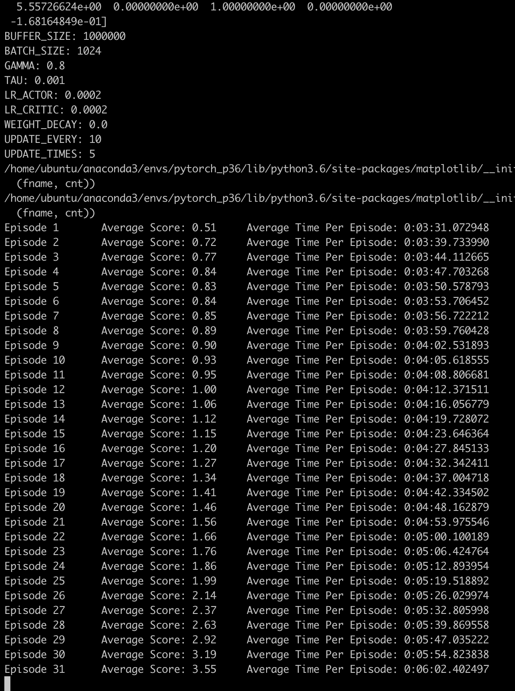
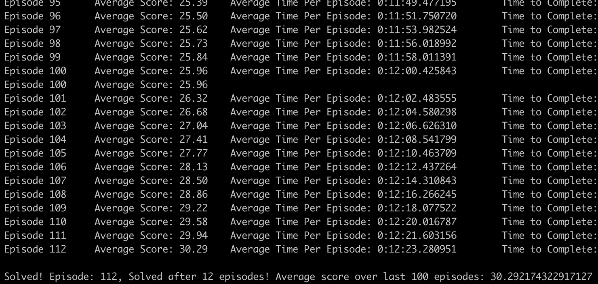
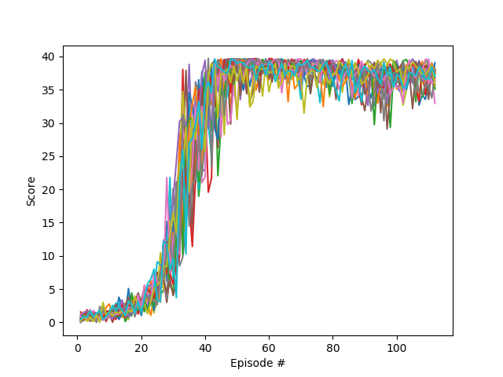

# Report

## Learning Algorithm

The environment is solved using a DDPG agent. The agent has been amended to allow it to work with multiple agents. The same code can be used to solve both the single agent environment and the multiple agent environment simply by changing the `--filename` passed to the ddqn.py script.

The actor and critic networks are very much the same, in that they both use 3 fully connected layers `fc1_units=256, fc2_units=256` in the case of the multi agent solve and `fc1_units=400, fc2_units=300` in the single agent scenario, the actor  has an output of the action size, in this case `4`. The critic returns a single value.

The agent in turn creates the required number of actor and critic models and stores them in a local variable. The modifications are: when taking a step each agents adds its state to the shared replay buffer and then every 10 steps updates each agent 5 times with a batch of `1024` samples.

Hyperparameters:

```python
BUFFER_SIZE: 1000000
BATCH_SIZE: 1024
GAMMA: 0.8
TAU: 0.001
LR_ACTOR: 0.0002
LR_CRITIC: 0.0002
WEIGHT_DECAY: 0.0
UPDATE_EVERY: 10
UPDATE_TIMES: 5
```

Buffer Size:
1MM may be a bit large in this case but gives us a broad sample size to learn from

Batch Size:
I played with a variety of batch sizes (`100`, `256`, `512`) but `1024` seemed to give me the best results with consistent learning.

Gamma:
Reducing the discount factor allowed the agent to make more decisions, immediate reward is great but we want to value future rewards as well. This could possible be dropped further for better results.

Tau:
The low tau shifts the prediction models to the target models more gradually

Learning Rates:
I tried using a bunch of different learning rates. Actor: `0.001`, `0.0001` Critic: `0.001`, `0.005`. Leaving the learning rate of both Actor and Critic to be the same `0.0002` gave the best performance.

Weight Decay:
Left at `0` and did not change for this solution

Update Every and Update Times: In the solve of the single agent I left these values at `1` & `1` meaning to update every time, once. In solving the 20 agent problem not only for performance but to prevent the algorithm from crashing early thse were switched to update every `10` steps, `5` times. To great success!

---

## Rewards - Success!

Single: `Solved! Episode: 272, Solved after 172 episodes! Average score over last 100 episodes: 30.024699328895657`

Results can be seen here: [Notebook](done/Continuous_Control.ipynb)

Multi Agent: `Solved! Episode: 112, Solved after 12 episodes! Average score over last 100 episodes: 30.292174322917127`
As can be seen in the below image, training started off quickly!




## Future improvements or research areas

* Play with the hyperparameters, currently the DDQN takes a long time to run, while the performance per episode is great, training takes a very long time, reducing the batch size and the gamma value should help to improve that.
* Training less often would also help improve the performance. Right now 5 updates every 10 steps might be a bit heavy
* Right now we use 20 agents and 20 critics. What if we used a single agent 20 times to act? Since we are adding to the same shared replay buffer we'd only then train one agent again.